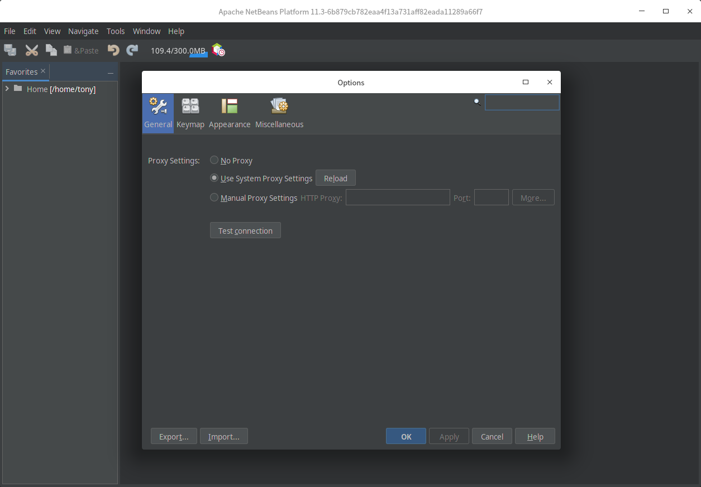

# netbeans-rcp-lite

The original netbeans project uses ant to build, I just tried to remove all build magic and make it a simple maven project. 

## build

```
mvn clean install
```

## run rcp demo

```
mvn -p rcp
```

or in Netbeans, right click rcp project, and click `Run`

## screenshots

